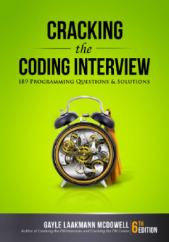

# cracking-the-coding-interview
<p align="left">
    <a href="https://www.python.org/downloads/">=v3.6-blue.svg"></a>
    <a href="https://opensource.org/licenses/MIT"></a>
</p>


Some of the 189 problems from the book Cracking the Coding Interview 6th Edition solved in Python. 

- Link to the book: [Cracking the Coding Interview](https://www.crackingthecodinginterview.com/)

<details><summary><b>Readme contents</b></summary>

- [1. Repository contents](#1-Repository-contents)
- [2. Installation](#2-Installation)
- [3. Usage](#3-Usage)
- [4. Troubleshooting](#4-Troubleshooting)
- [5. Disclaimer](#5-Disclaimer)
- [6. Help wanted](#6-Help-wanted)
- [7. Other links](#7-Other-links)

</details>

</br>




## 1. Repository contents

This repository contains the problems from the book that have direct application in the Python programming language.

**Data structures**  
[WIP] Chapter 1. [Arrays and Strings](notebooks/CtCI-01-SolutionsToArraysAndStrings.ipynb)  
[WIP] Chapter 2. [Linked Lists](#1-what-is-pytemplate)  
[WIP] Chapter 3. [Stacks and Queues](#1-what-is-pytemplate)  
[WIP] Chapter 4. [Trees and Graphs](#1-what-is-pytemplate)  

**Concepts and algorithms** 
[WIP] Chapter 5. [Bit Manipulation](#1-what-is-pytemplate)  
[WIP] Chapter 6. [Math and Logic Puzzles](#1-what-is-pytemplate)  
[WIP] Chapter 7. [Object-Oriented Design](#1-what-is-pytemplate)  
[WIP] Chapter 8. [Object-Oriented Design](#1-what-is-pytemplate)  
[WIP] Chapter 9. [Object-Oriented Design](#1-what-is-pytemplate)  
[WIP] Chapter 10. [Object-Oriented Design](#1-what-is-pytemplate)  
[WIP] Chapter 11. [Object-Oriented Design](#1-what-is-pytemplate) 

**Aditional review problems**  
[WIP] Chapter 16. [Moderate](#1-what-is-pytemplate)  
[WIP] Chapter 11. [Hard](#1-what-is-pytemplate)  


## 2. Installation

To run the notebooks with the coding problems you only need to clone this repository, have Python 3.6 or higher and, Jupyter notebook 6.5 or higher. It is not necessary to install additional libraries.


## 3. Usage

The repository follows this tree structure directory:

```
cracking-the-coding-interview                           <- Data used for the project.
├── images                                              <- Images directory.
│   └── ctci-cover.png                                  <- Image from the book cover.
├── notebooks                                           <- Notebooks directory.
│   ├── CtCI-01-SolutionsToArraysAndStrings.ipynb       <- Python notebook with solutions.
│   ├── CtCI-02-SolutionsToLinkedLists.ipynb            <- Python notebook with solutions.
│   ├── CtCI-03-SolutionsToStacksAndQueues.ipynb        <- Python notebook with solutions.
│   ├── CtCI-04-SolutionsToTreesAndGraphs.ipynb         <- Python notebook with solutions.
│   ├── CtCI-05-BitManipulation.ipynb                   <- Python notebook with solutions.
│   ├── CtCI-06-SolutionsToMathAndLogicPuzzles.ipynb    <- Python notebook with solutions.
│   └── helpers.py                                      <- Python helpers file.
├── LICENSE                                             <- License file.
└── README.md                                           <- README file with the project info.
```

All the problems and solutions are written in notebooks inside the */notebooks* directory. The notebooks use functions from the */helpers.py* file to test solutions or print specific structures.


## 4. Troubleshooting

Errors, future updates, or beta configurations. Explain why and how it could break.


## 5. Disclaimer

Explain the dos and don'ts of your app, what you take responsibility for, and where is the limit of its purpose.


## 6. Help wanted

Some extra help or clarification about the whole process. What you don't provide.


## 7. Other links

- Link to the book: [Cracking the Coding Interview](https://www.crackingthecodinginterview.com/)
- Link to the solutions: [CtCI 6th Edition](https://github.com/careercup/CtCI-6th-Edition)
- About the author: [Gayle Laakmann McDowell](https://www.crackingthecodinginterview.com/author.html)
- For more information visit: [carlosgrande.me](https://carlosgrande.me/)
